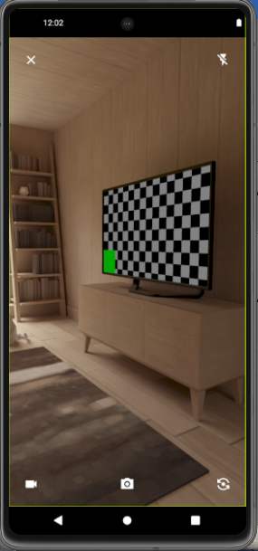
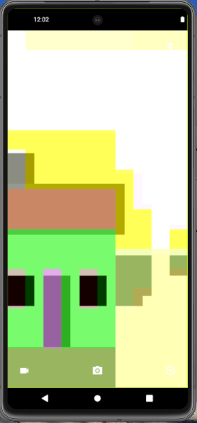

A flutter package that show a customize camera (front and back) to take photos or record videos, similarly for create story in social media.

## Getting started

As a `camera` dependency, you need to edit the `info.plist` file in iOS and `android/app/build.gradle` file.

In iOS, if editing `info.plist` as text, you should add:
```xml
<key>NSCameraUsageDescription</key>
<string>your usage description here</string>
<key>NSMicrophoneUsageDescription</key>
<string>your usage description here</string>
```

In Android, change the minimum Android sdk version to 21 (or higher) in your `android/app/build.gradle` file:

```groovy
minSdkVersion 21
```

## Features
Example with back camera in emulator




Example with front camera in emulator



## Usage

```dart
File? file;

StoryCamera(
  onImageCaptured: (value) {
    file = File(value.path);
    print(file!.path);
  }, 
  onVideoRecorded: (value) {
    file = File(value.path);
    print(file!.path);
  }, 
  onClosePressed: () {
    // Most common
    // Navigator.pop(context);
  },
  
  // Optional params
  iconsColor: Colors.green,
  recordingIconColor: Colors.red
);
```

## Additional information

If you want to see more information about this package, I invite you to visit the GitHub repo.

https://github.com/ma-sc-24/story_camera
